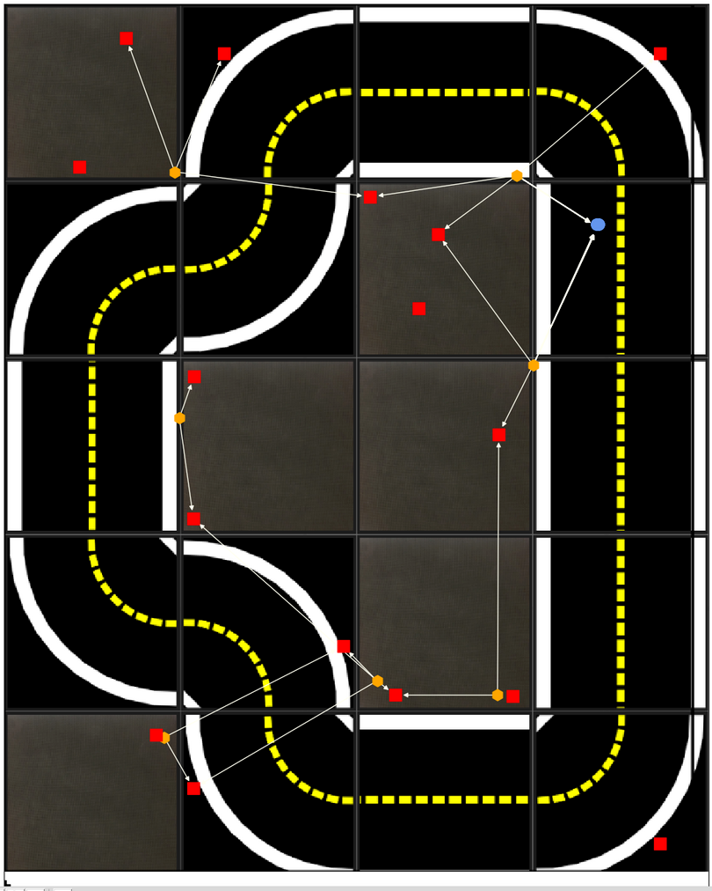
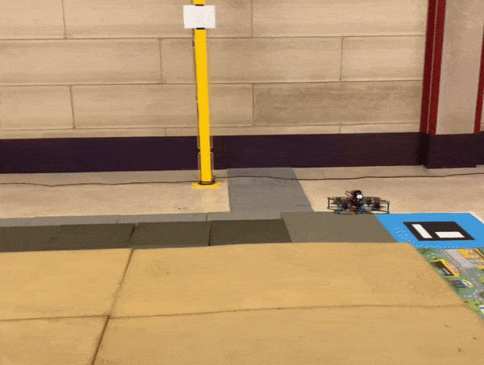

## About Me

I am a Robotics Engineer specializing in autonomous quadcopters for educational applications at [Duckietown](https://duckietown.com/).

I earned my BSc in Aerospace Engineering from the Polytechnic of Turin, where I developed my thesis under the supervision of Prof. Giuliana Mattiazzo. My work focused on designing telemetry systems for high-performance sailing boats used in competitive racing as part of the Polito Sailing Team.

I then pursued an MSc in Space Engineering at the Polytechnic of Milan, where I conducted my master’s thesis on reinforcement learning for planetary landing under the supervision of Prof. Michèle Lavagna during my internship at Deimos Space.

Additionally, I explored multi-agent SLAM and the adaptation of visuomotor policies during a research internship at the Toyota Technological Institute at Chicago, working under the guidance of Prof. Matthew Walter.

---

## Research Interests

I am passionate about advancing robotics by integrating machine learning and control theory for real-world applications. My current interests include:

- Autonomous systems for aerial robotics.
- Reinforcement learning for adaptive control.
- Multi-agent SLAM and navigation in dynamic environments.

---

## Publications

**Davide Iafrate**, Andrea Brandonisio, Robert Hinz, Michèle Lavagna,  
*Propulsive Landing of Launchers’ First Stages with Deep Reinforcement Learning*,  
Acta Astronautica, 2024,  
[https://doi.org/10.1016/j.actaastro.2024.11.028](https://www.sciencedirect.com/science/article/pii/S0094576524006751).

---
## Projects

  
  

    <h3>6DOF Planetary Landing Simulator</h3>
    
Reinforcement learning for 6DOF control in planetary landing simulations.

    <a href="https://github.com/Tuxliri/RL_rocket_6DOF">GitHub Repository</a>
  

  
  

    <h3>Multi-Agent SLAM</h3>
    
Research on collaborative SLAM for autonomous navigation in smart cities. I contributed to integrating odometry data from the vehicles to increase 3x the frequency of the localization estimate.

    <a href="https://docs.duckietown.com/ente/opmanual-autolab/localization.html">Website</a>, 
    <a href="https://github.com/duckietown/dt-autolab-localization/tree/ente">GitHub Repository</a>
  

  
  

    <h3>Adaptive MRAC Controller for Quadcopter</h3>
    
This project aimed to achieve trajectory tracking for a quadrotor using adaptive control laws by developing a baseline PI controller with LQR methodology, incorporating adaptive augmentation for handling uncertain aerodynamic effects, and introducing robust modifications to maintain performance under disturbances.

    <a href="https://drive.google.com/file/d/16t8BSKxa3bfU_RHP4xnpEdpsmCwHhyGs/view?usp=sharing">Report</a>, 
    <a href="https://youtube.com/shorts/GGJCI4cSY00?feature=share">Video</a>
  

---

## Contact

- Email: [davideiafrate@icloud.com](mailto:davideiafrate@icloud.com)
- GitHub: [https://github.com/Tuxliri](https://github.com/Tuxliri)
- LinkedIn: [Davide Iafrate](https://www.linkedin.com/in/davide-iafrate-b1a4011bb/)
